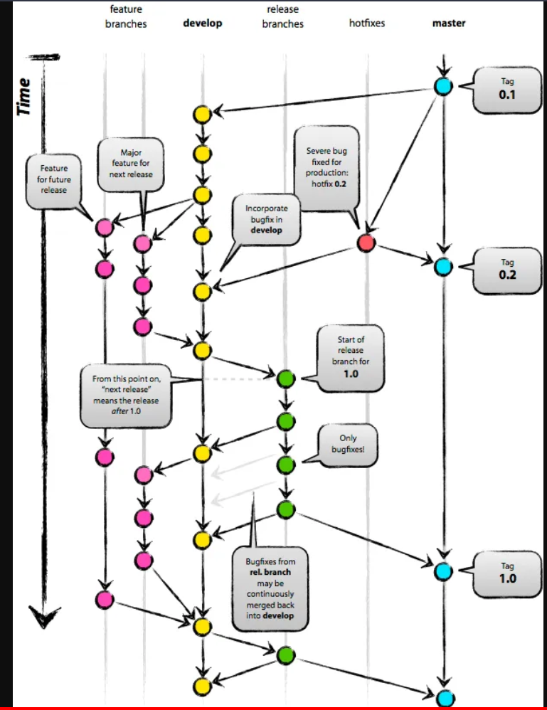

## AngelSigueros

## REPOSITORIO ESPECIAL EN GITHUB CON USERNAME

Si en Github creamos un repositorio con el mismo nombre que nuestro username es un repositorio especial donde añadir un README que aparecerá

username: AngelSigueros

repositorio: AngelSigueros

##  BORRAR REPOSITORIO

En settings, hacer scroll hacia abajo del todo, en Danger zone permite borrar.

## GIT FLOW

